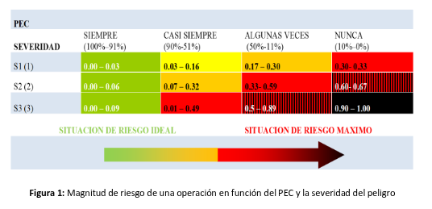

# MILC

### 1. Lógica conceptual de la guía

Se definen dos niveles de cálculo:

```
PEC → MR → resultado
```

donde:

* PEC = Porcentaje de Ejecución Correcta.
* MR = Magnitud de Riesgo.
* Severidad = gravedad potencial del peligro, de 1 a 3.

El PEC mide con qué frecuencia se realiza correctamente un paso, clasificándolo en cuatro niveles:

| PEC | Interpretación |
| --- | --- |
| 91–100% | Siempre |
| 51–90% | Casi siempre |
| 11–50% | Algunas veces |
| 0–10% | Nunca |

Y después se combina ese nivel de PEC con la severidad para obtener la Magnitud de Riesgo, entre 0 y 1.

La figura original muestra precisamente las 12 combinaciones posibles de 4 niveles de PEC x 3 niveles de severidad:



### 2. Implementación

La arquitectura separa las cosas de la siguiente manera:

```txt
Árbol de navegación
       │
       │ metadatos
       ▼
Registro de interacciones
       │
       │ respuestas históricas
       ▼
   scoring.js
       │
       ├── PEC
       ├── MR
       └── resultado por categoría
```

Dado que hay cientos de vistas y formularios heterogéneos, la vista no necesita saber cómo calcular su score. Simplemente declara:

```json
{
    "scenario": "ACON-01-02",
    "score-answer": "yes",
    "severity": 3,
    "periodicity": "daily",
    "category": "milk-care"
}
```

y registra la interacción.

El motor de scoring interpreta esos datos posteriormente.

El propio [scoring.js](src/model/scoring.js) está diseñado como funciones puras: recibe datos y devuelve resultados, sin acceder al almacenamiento ni depender de la UI.

### 3. Ejemplo

Supongamos el nodo 129 en [nodes.json](/src/survey/nodes.json):

```json
"view-129": {
        "category": "milk-care",
        "fields": [
            {
                "id": "view-129-select",
                "options": [
                    {
                        "label": {
                            "en": "Yes",
                            "es": "Si"
                        },
                        "target": "view-131",
                        "value": "yes"
                    },
                    {
                        "label": {
                            "en": "No",
                            "es": "No"
                        },
                        "target": "view-133",
                        "value": "no"
                    },
                    {
                        "label": {
                            "en": "Don't know",
                            "es": "No se"
                        },
                        "target": "view-128",
                        "value": "dont-know"
                    }
                ],
                "type": "select"
            }
        ],
        "guide-id": "Filtrar la leche recién ordeñada, conservar la leche según momento de elaboración",
        "icon": "filter.png",
        "manual-page": "31 y 32",
        "milking-method": "mecanico",
        "periodicity": "daily",
        "scenario": "ACON-01-02",
        "score-answer": "yes",
        "severity": 3,
        "showDate": true,
        "subtitle": {
            "en": "Did you filter the milk?",
            "es": "¿Filtraste la leche?"
        },
        "title": {
            "en": "Milk conditioning",
            "es": "Acondicionar la leche"
        }
    },
```

significa esencialmente:

"Esta vista representa el escenario ACON-01-02. La respuesta correcta es yes. El peligro tiene severidad 3 y esta práctica debería realizarse diariamente."

La guía efectivamente identifica ACON 01 como "Filtrar la leche recién ordeñada", y pregunta si se filtra según las indicaciones.

Por lo tanto:

```txt
scenario       = ACON-01-02
correctAnswer  = yes
severity       = 3
periodicity    = daily
category       = milk-care
```

El target:

```json
"target": "view-131"
```

no interviene en el scoring. Sirve exclusivamente para decidir a qué vista navegar.


### 4. Primer paso: determinar cuántas veces debería haberse realizado

La función:

```js
expectedOccurrences(periodicity, totalDays)
```

transforma la periodicidad en una cantidad esperada de ejecuciones.

Actualmente usa:

```js
daily             → 1
every-other-day   → 1/2
weekly            → 1/7
biweekly          → 1/15
monthly           → 1/30
semester          → 1/120
```

y luego:

```js
expected = floor(totalDays * rate)
```

Esto está implementado en las líneas 104–115.

Por ejemplo, si una práctica es diaria y el usuario tiene registros en 10 días distintos, entonces:

```txt
expected = 10 x 1 = 10
```

Para una práctica semanal:

```txt
10 días x 1/7 = 1.42
floor         = 1
```

### 5. Segundo paso: eliminar "No sé"

La aplicación trata ```dont-know``` como una respuesta que no puntúa. Es decir, no es ni correcta ni incorrecta.

El código hace:

```js
const scored = records.filter(r => r.answer !== "dont-know");
```

### 6. Tercer paso: calcular PEC

Después se cuentan los días distintos en los que hubo una respuesta puntuable:

```js
const distinctDays = new Set(scored.map(r => r.date)).size;
```

Luego se cuenta cuántas respuestas fueron correctas:

```js
const correct = scored.filter(r => r.answer === correctAnswer).length;
```

Y:

```js
pec = correct / expected
```

con un máximo de 1:

```js
Math.min(correct / expected, 1)
```

#### Ejemplo

Supongamos:

```txt
scenario: ACON-01-02
periodicity: daily

Día 1 → yes
Día 2 → yes
Día 3 → no
Día 4 → yes
Día 5 → no
```

Entonces:

```txt
expected = 5
correct  = 3

PEC = 3 / 5
    = 0.60
    = 60%
```

Después ```classifyPEC()``` determina:

```js
0.91 o más → always
0.51–0.90 → almostAlways
0.11–0.50 → sometimes
0–0.10 → never
```

Por lo tanto:

```txt
PEC = 60%
     ↓
almostAlways
```

### 7. Cuarto paso: PEC + severidad → MR

Hasta el commit ([```18c6fd6```](https://github.com/sendevo/milc/commit/18c6fd60c8811eb6061384b3e0805585a62fff68)), el código tenía una tabla que asignaba un valor fijo de MR para cada combinación entre la categoría de PEC y la severidad. Por ejemplo:

```js
const MR_TABLE = {
    always: {
        1: 0.00,
        2: 0.00,
        3: 0.00
    },

    almostAlways: {
        1: 0.01,
        2: 0.10,
        3: 0.37
    },

    sometimes: {
        1: 0.37,
        2: 0.77,
        3: 0.90
    },

    never: {
        1: 0.67,
        2: 1.00,
        3: 1.00
    }
};
```

Esto presenta un problema: la guía define rangos de MR, no un único valor para cada categoría.

Por ejemplo, para una severidad 3, un PEC del 60 % no debería necesariamente tener el mismo MR que un PEC del 51 %, aunque ambos pertenezcan a la categoría "casi siempre".

Por eso, la implementación se modificó para calcular directamente la Magnitud de Riesgo a partir del PEC y la severidad:

$$
MR = \frac{Severidad \cdot \left(1-PEC\right)}{3}
$$

De esta manera, el MR es un valor continuo entre 0 y 1.

Por ejemplo, con severidad 3:

| PEC | MR |
| --- | --- |
|100 % | 0.00|
|90 % | 0.10|
|75 % | 0.25|
|50 % | 0.50|
|25 % | 0.75|
|0 % | 1.00|

Y con severidad 1:

| PEC | MR |
| --- | --- |
|100 % | 0.00|
|90 % | 0.03|
|50 % | 0.17|
|0 % | 0.33|

Esto permite conservar las cuatro categorías de PEC —siempre, casi siempre, algunas veces y nunca— para la clasificación, pero sin perder la información del porcentaje exacto de cumplimiento.

Por lo tanto, el flujo queda:

```txt
PEC → categoría de PEC → MR calculado a partir del PEC y severidad.
```

La implementación actual de ```computeMR``` es:

```js
export const computeMR = (pec, severity) => {
    const safePec = Number.isFinite(pec)
        ? Math.min(1, Math.max(0, pec))
        : 0;

    const safeSeverity = Number.isFinite(severity)
        ? Math.min(3, Math.max(1, severity))
        : 1;

    const mr = (safeSeverity * (1 - safePec)) / 3;

    return Math.min(1, Math.max(0, mr));
};
```
Así, el MR deja de ser un valor fijo asociado a una celda de la tabla y pasa a representar directamente el nivel de riesgo correspondiente al cumplimiento observado.

### 8. Quinto paso: agrupar por categoría

Una vez calculado el MR de cada escenario, el sistema los agrupa por:

```json
"category": "milk-care"
``` 

Por ejemplo:

```
Escenario 1 → MR = 0.10
Escenario 2 → MR = 0.25
Escenario 3 → MR = 0.00
Escenario 4 → MR = 0.50
```

Entonces calcula:

$$
MR_{avg} = \frac{0.10+0.25+0.00+0.50}{4} = 0.2125
$$

### 9. Sexto paso: MR promedio → evaluación

Finalmente en ```classifyResult()```

```js
if (avgMR <= 0.10)
    "excellent"
else if (avgMR <= 0.50)
    "very-good"
else if (avgMR <= 0.90)
    "regular"
else
    "needs-improvement"
```

Por lo tanto:

|MR promedio | Resultado|
| --- | --- |
|0.00–0.10 |Excelente|
|>0.10–0.50 | Muy bueno|
|>0.50–0.90 | Regular|
|>0.90 | Necesita mejorar|

Y después el resultado determina una vista:

```txt
excellent
    ↓
view-result-excellent

very-good
    ↓
view-result-good

regular
    ↓
view-result-regular

needs-improvement
    ↓
view-result-bad
```

### 10. Resumen del pipeline:

```txt
                 NODE TREE
                     │
                     │
       ┌─────────────┼────────────────┐
       │             │                │
   scenario     score-answer      severity
       │             │                │
       │        periodicity       category
       │             │                │
       └─────────────┼────────────────┘
                     │
                     ▼
              USER INTERACTION LOG
                     │
                     │
                     ▼
              ┌───────────────┐
              │  computePEC() │
              └───────┬───────┘
                      │
                correct/expected
                      │
                      ▼
                    PEC
                      │
                      ▼
              classifyPEC()
                      │
          ┌───────────┴───────────┐
       always             almostAlways
       sometimes                never
          └───────────┬───────────┘
                      │
                      │ + severity
                      ▼
                computeMR()
                      │
                      ▼
                     MR
                      │
                      ▼
             group by category
                      │
                      ▼
               average MR
                      │
                      ▼
              classifyResult()
                      │
          ┌───────────┼────────────┐
          ▼           ▼            ▼
      excellent    very-good    regular ...
```

Todo esto está concentrado en ```computeFullScore()```.

El sistema actual puede describirse matemáticamente como:

$$
PEC = min\left(\frac{respuestas correctas}{ocurrencias esperadas}, 1 \right)
$$

luego:

$$
PEC \to \text{categoría PEC}
$$

y:

$$
\left(\text{categoría PEC, severidad}\right) \to MR
$$

después:

$$
MR_{\text{categoría}} = \frac{\sum MR_{text{escenarios}}}{N_escenarios}
$$

y finalmente:

$$
MR_{\text{categoría}} \to \{\text{excellent}, \text{very-good}, \text{regular}, \text{needs-improvement} \}
$$


### 11. Comentarios finales
Las vistas registran hechos, los nodos aportan metadatos y el scoring reconstruye las métricas después. Esto permite mantener los más de 100 formularios completamente heterogéneos sin meter lógica de scoring específica dentro de cada vista.

